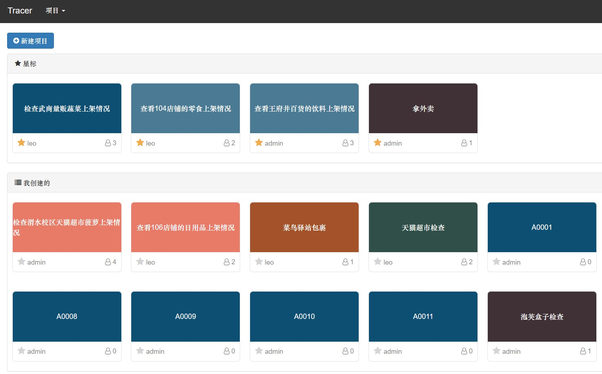
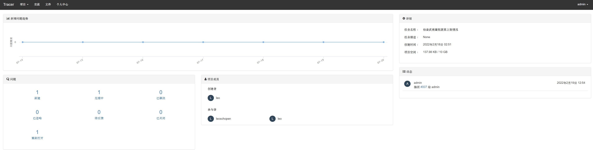
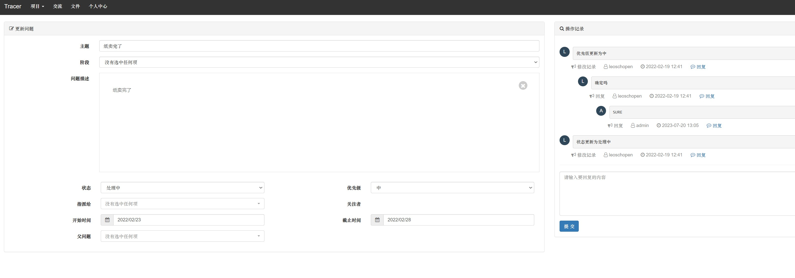
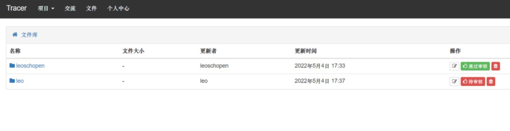

# 众包任务平台
基于Django的”拍照赚钱“任务分发众包平台，根据层次分析法与神经网络等制定相应的定价策略，平台分任务发放者和任务领取者，发放者填写任务具体要求与相应的信息，任务价格将会动态改变。领取者可以根据自己的位置与信誉领取相应的任务，完成任务后可以获得相应的报酬。

# 功能
1. 用户注册和登录
不同用户角色(任务发布者、任务接单者)

2. 发布任务
标题、描述、预算、需求人数、地点、图片等

3. 任务发现和抢单、wiki任务进度跟踪、评价、记录
   
4. 用户信息和评级、根据用户信誉和位置生成价格

# 部署
## 环境
Python 3.6+
Django 2.0+
信息注册短信验证需要腾讯云短信服务，在settings.py中配置

## 安装
git clone https://github.com/leoschopen/crowdsourcing-platform.git

创建并激活虚拟环境

pip install -r requirements.txt

运行数据库迁移

python manage.py migrate

启动服务器

python manage.py runserver 8000

应用将运行在 http://localhost:8000

# 使用说明
用户可以注册成为任务发布者或接单者
任务发布者可以发布任务,填写标题、描述、预算、地点等信息
接单者可以浏览任务并抢单
任务发布者可以指派任务给接单者,并跟踪进度

# 界面
1. 任务管理界面

2. 任务详情界面

3. 任务进度追踪界面

4. 任务相关文件仓库

# 贡献
欢迎提交 Pull Request。如果发现任何问题或需要改进的地方,请开 Issue。

